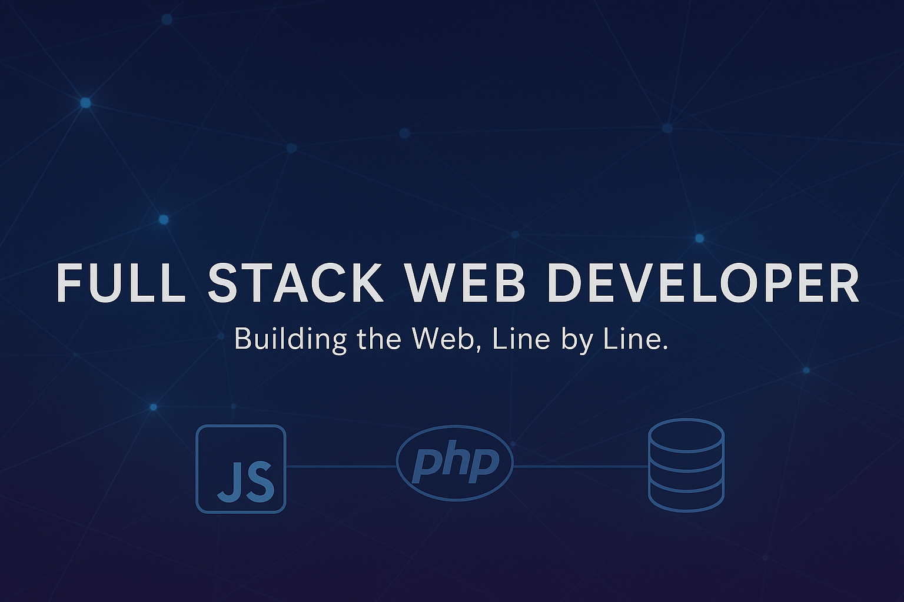

# Hi, I'm Galang Novi Anggara 👋

I'm a **Full-Stack Web Developer** passionate about building reliable, scalable, and user-focused digital solutions.  
My main expertise lies in **JavaScript, PHP, TypeScript, and Node.js**, and I enjoy bridging backend logic with seamless frontend experiences using modern frameworks and tools.

Here, you'll find my personal projects, technical experiments, and open-source contributions — all focused on clean architecture, performance, and maintainability.

---

## 💼 Current Focus
- Developing full-stack web applications using **Express, React/Next, and Prisma**.  
- Exploring **unit and integration testing** to ensure code quality.  
- Enhancing application performance and state management using **Redux Toolkit** and **TanStack Query**.

---

## ⚙️ Technical Skills
**Languages & Runtime:**  
PHP, JavaScript (ES6+), TypeScript, Node.js  

**Frontend:**  
React, Next.js, Tailwind CSS, Shadcn/UI  

**Backend:**  
Express.js, Prisma ORM, Laravel, PostgreSQL, RESTful API  

**Testing & Tools:**  
Jest, Postman, Thunder Client  

**Others:**  
Docker, Git, Vercel Deployment  

---

## 📊 GitHub Stats
  

---

## 📫 Get in Touch

  
  
  

---

Thank you for visiting my profile!  
I'm always open to collaboration, technical discussions, and exciting new opportunities. 🚀
